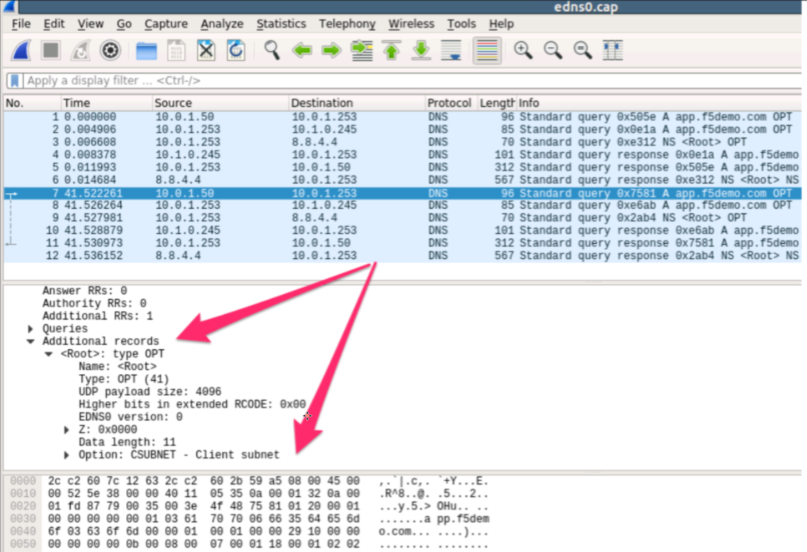
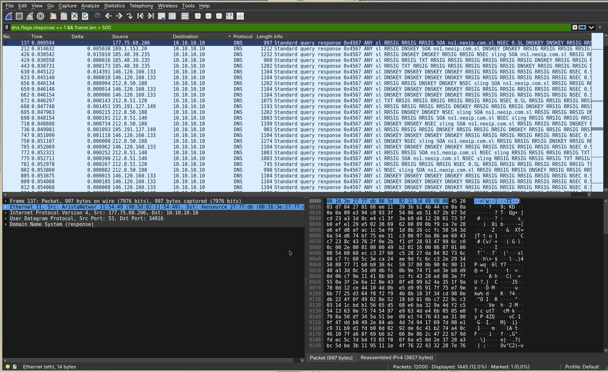
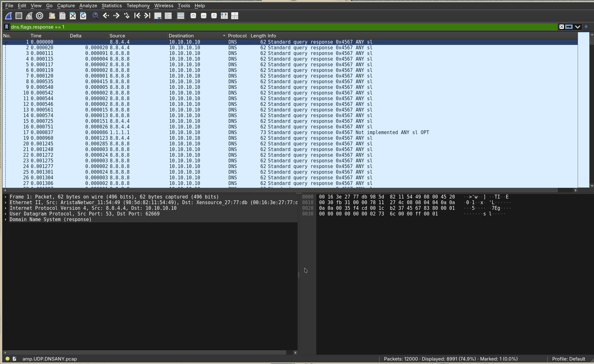
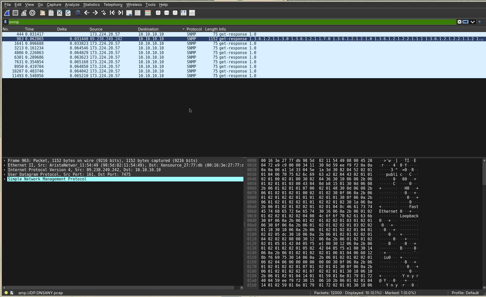

# DNS Amplification Attack

> M. Nadhif Pasya Ikhsan
M. Hugo Rayandra
Raffa Al Azmi
I Ketut Weda Adikusuma

## Apa sih DNS Amplification Attack?

Semua serangan amplifikasi mengeksploitasi perbedaan konsumsi bandwidth antara penyerang dan sumber daya web yang ditargetkan. Ketika disparitas biaya diperbesar di banyak permintaan, volume lalu lintas yang dihasilkan dapat mengganggu infrastruktur jaringan. Dengan mengirimkan kueri kecil yang menghasilkan respons besar, pengguna jahat dapat memperoleh lebih banyak dari lebih sedikit. Dengan mengalikan pembesaran ini dengan meminta setiap bot di botnet membuat permintaan serupa, penyerang dikaburkan dari deteksi dan memperoleh manfaat dari peningkatan lalu lintas serangan.


Bot tunggal dalam serangan amplifikasi DNS dapat dipikirkan dalam konteks remaja jahat yang menelepon restoran dan mengatakan “Saya akan memiliki salah satu dari semuanya, silakan hubungi saya kembali dan beri tahu saya seluruh pesanan saya.” Ketika restoran meminta nomor panggilan balik, nomor yang diberikan adalah nomor telepon korban yang ditargetkan. Target kemudian menerima telepon dari restoran dengan banyak informasi yang tidak mereka minta.


Sebagai hasil dari setiap bot membuat permintaan untuk membuka resolver DNS dengan alamat IP palsu, yang telah diubah ke alamat IP sumber nyata dari korban yang ditargetkan, target kemudian menerima respons dari resolver DNS. Untuk menciptakan lalu lintas dalam jumlah besar, penyerang menyusun permintaan sedemikian rupa sehingga menghasilkan respons sebesar mungkin dari resolver DNS. Akibatnya, target menerima amplifikasi lalu lintas awal penyerang, dan jaringan mereka menjadi tersumbat dengan lalu lintas palsu, menyebabkan penolakan layanan.


## Studi Kasus
Studi kasus Contoh Kasus Nyata: Serangan Spamhaus (2013)
Sumber: [https://bandung.kompas.com/read/2013/03/28/11571269/index.html](https://bandung.kompas.com/read/2013/03/28/11571269/index.html).
Sebuah serangan cyber berjenis distributed denial of service (DDoS) terhadap perusahaan keamanan jaringan Spamhaus memiliki dampak yang sangat besar. Akibat serangan tersebut, dikabarkan kecepatan internet dunia, terutama di benua Eropa, terus melambat sehingga para pengguna tidak dapat mengakses layanan dasar internet, seperti e-mail dan layanan perbankan online.
Pada studi kasus ini menjelaskan tentang serangan DDoS masif terhadap Spamhaus, yang menggunakan teknik DNS Amplification pada layer *IP Services/Application Layer*.&nbsp;
untuk mengidentifikasi kita bisa melihat di wireshark dengan melihat ada beberapa anomali yang muncul&nbsp;
1. Ketimpangan Ukuran Paket (High Asymmetry Ratio): Paket kueri (*request*) sangat kecil (60–100 Byte), sedangkan paket jawaban (*response*) berukuran sangat besar (1.000–4.000+ Byte).  
2. Lonjakan Volume Paket UDP Port 53: Ribuan paket balasan DNS masuk ke alamat IP korban dalam waktu yang sangat singkat.  
3. Kueri Tipe `ANY` / `TXT` dan penggunaan `EDNS0`: Penyerang meminta seluruh record domain untuk memaksimalkan ukuran balasan paket. Pada detail paket Wireshark, bagian `Additional records` menunjukkan ekstensi `OPT` dengan ukuran *UDP payload size* besar (misal 4096).  
4. Alamat Pengirim (*Source IP*) Bervariasi**:** Balasan DNS berasal dari ribuan IP *Open Resolver* yang berbeda-beda ke satu IP *Destination* (yaitu IP milik korban)

 
## Hands-on PCAP

### File PCAP

[amp.UDP.DNSANY.pcap](https://github.com/StopDDoS/packet-captures/blob/main/amp.UDP.DNSANY.pcap)

### Identifikasi DNS Amplification Attack

1. Query Response Paket DNS Yang diatas batas normal
Menggunakan Filter ```dns.flags.response == 1 && frame.len > 500```, kueri request DNS biasanya berukuran sangat kecil (sekitar 60–70 byte) dan respons nya sangat besar.



2. IP Destination Yang di Flood
```dns.flags.response == 1```


3. Anomali Protokol Selain DNS saat Diserang
menggunakan filter ```snmp``` untuk memfilter protokol SNMP



## Kesimpulan

Dokumen ini membahas secara komprehensif mekanisme dan identifikasi **DNS Amplification Attack**, yaitu serangan DDoS berbasis layer aplikasi yang memanfaatkan ketimpangan penggunaan *bandwidth* antara penyerang dan target. Serangan ini dilancarkan dengan mengerahkan jaringan *botnet* untuk mengirimkan kueri DNS berukuran kecil (60–100 Byte) yang telah dipalsukan alamat IP pengirimnya (*IP Spoofing*) ke server-server *open resolver*. Dengan menyertakan kueri tipe `ANY`/`TXT` serta memanfaatkan fitur `EDNS0` (ekstensi `OPT` record), balasan dari *open resolver* membengkak hingga berukuran 1.000–4.000+ Byte dan membanjiri IP target secara masif hingga melumpuhkan jaringan. Dampak nyata dari teknik ini terlihat pada studi kasus serangan masif terhadap Spamhaus pada tahun 2013, yang memicu perlambatan internet global dan mengganggu berbagai layanan dasar seperti *e-mail* serta perbankan digital. Berdasarkan analisis forensik jaringan pada file PCAP (`amp.UDP.DNSANY.pcap`) menggunakan Wireshark, serangan ini dapat diidentifikasi melalui lonjakan drastis volume paket UDP Port 53, ketimpangan rasio ukuran paket *request* dan *response*, tingginya variasi IP pengirim dari berbagai *open resolver*, serta kemunculan anomali lalu lintas pada protokol lain seperti SNMP di rentang waktu serangan.
## Source:

[https://www.cloudflare.com/learning/ddos/dns-amplification-ddos-attack/](https://www.cloudflare.com/learning/ddos/dns-amplification-ddos-attack/)

[https://clouddocs.f5.com/training/community/dns/html/class4/module1/module1.html\#:\~:text=Module%20%E2%80%93%20EDNS0%20and%20client%20subnet%C2%B6%20\*,to%20analyze%20DNS%20ends0%20client%20subnet%20transactions](https://clouddocs.f5.com/training/community/dns/html/class4/module1/module1.html#:~:text=Module%20%E2%80%93%20EDNS0%20and%20client%20subnet%C2%B6%20*,to%20analyze%20DNS%20ends0%20client%20subnet%20transactions).

